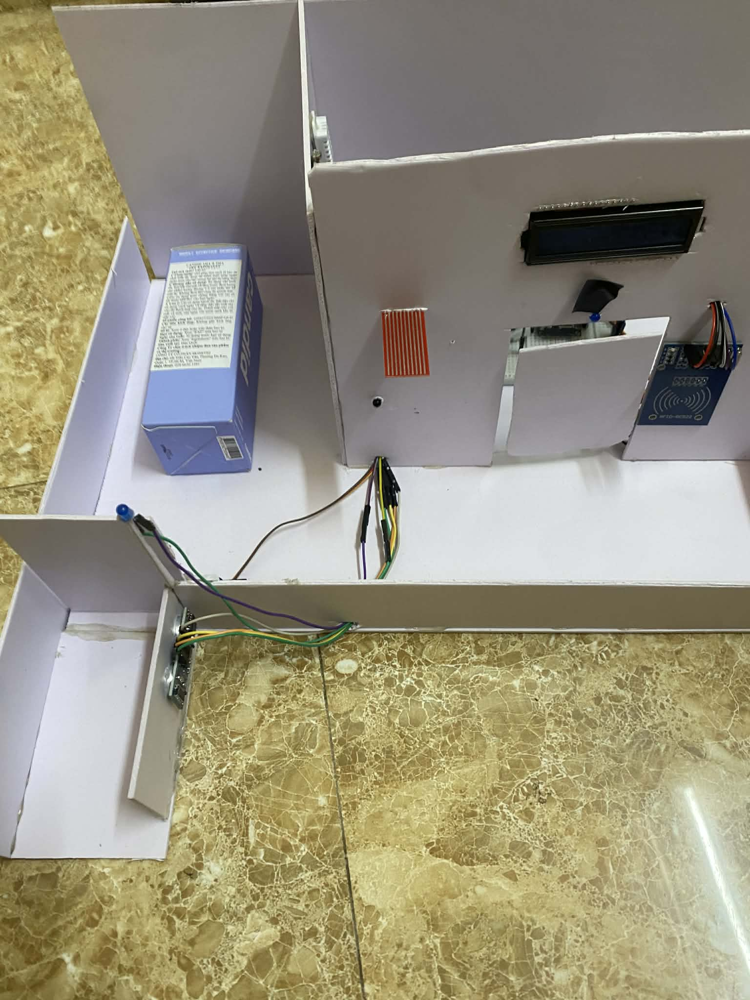
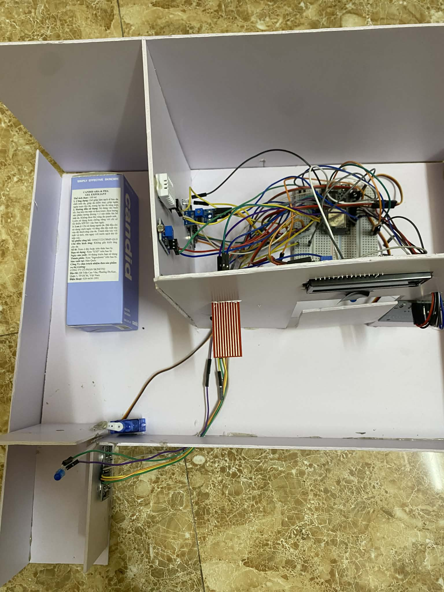
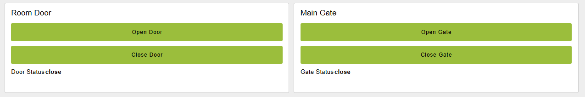
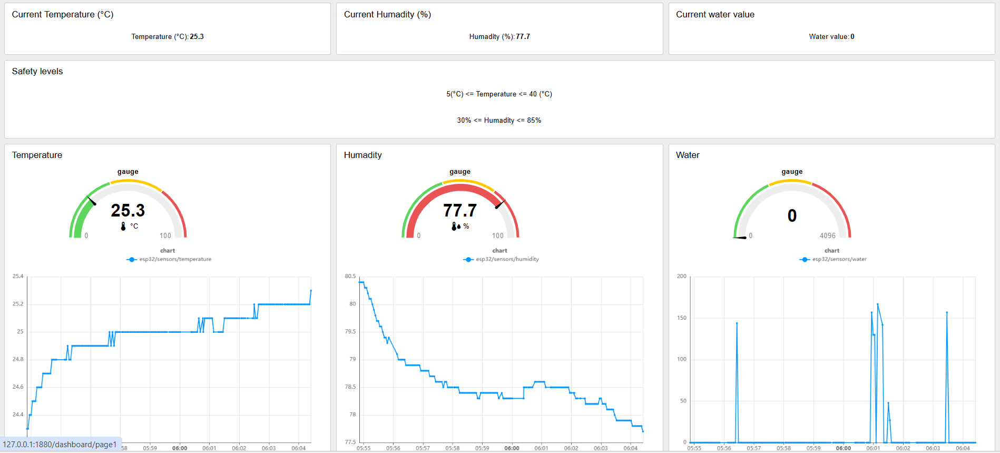
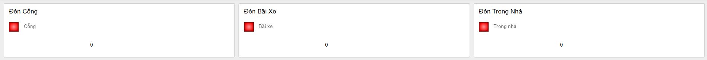

# iotcuoiki
Giới thiệu chung về dự án Smart Home IoT
Khái niệm Smart Home IoT
Smart Home IoT là hệ thống nhà thông minh kết nối Internet, cho phép giám sát và điều khiển các thiết bị trong nhà từ xa. Hệ thống tích hợp cảm biến, đèn, quạt, cửa, chuông báo và các thiết bị điện tử khác, hoạt động tự động hoặc theo lệnh người dùng. Mục tiêu là tăng tiện nghi, nâng cao an toàn, tiết kiệm năng lượng và dễ mở rộng cho ngôi nhà thông minh. Giao diện trực quan trên dashboard giúp người dùng theo dõi và quản lý mọi lúc mọi nơi.
Nội dung chính:

**1. Phần cứng**
Vi điều khiển ESP32 DevKit V1
cảm biến RFID
Cảm biến siêu âm (ultrasonic distance) SRF05
Cảm biến môi trường DHT22
Cảm biến ánh sáng LDR
Cảm biến mưa / nước
Cảm biến lửa
Servo
Đèn LED
Buzzer
LCD I2C 16x2

**2. Phần mềm**
Node-RED:
Máy chủ MQTT: EMQX
Môi trường phát triển: Visual Studio Code, Platform.IO

**3. Ý tưởng**
sơ đồ nhà

Sơ đồ chân cắm:

**4. Mô tả chức năng**
Hệ thống Smart Home IoT sử dụng ESP32 làm bộ điều khiển trung tâm, kết nối với Node-RED Dashboard 2 thông qua giao thức MQTT để điều khiển và giám sát các thiết bị trong nhà. Hệ thống tích hợp nhiều loại cảm biến và thiết bị thực thi nhằm tạo ra một ngôi nhà thông minh với khả năng tự động hóa, điều khiển từ xa và cảnh báo an ninh.

Cửa trong nhà được điều khiển bởi servo, kết hợp với LED trong nhà và quạt. Khi thẻ RFID hợp lệ được quét, cửa sẽ mở, LED và quạt bật, LCD hiển thị thông điệp chào mừng, đồng thời trạng thái mở cửa được gửi đến MQTT. Sau một khoảng thời gian cố định, cửa sẽ tự động đóng, LED và quạt tắt, trạng thái đóng cửa cũng được gửi đi. Ngoài việc mở bằng RFID, người dùng có thể điều khiển cửa từ dashboard thông qua MQTT với chủ đề esp32/cmd/door. Hệ thống còn hỗ trợ cảnh báo trộm khi quét quá số lần thẻ RFID sai, bật buzzer liên tục và hiển thị tin nhắn “CO TROM” trên LCD.

Cổng ra vào được điều khiển bằng servo và LED cổng. Hệ thống có khả năng mở cổng tự động khi xe đến gần dựa trên cảm biến siêu âm, đồng thời gửi trạng thái mở cổng qua MQTT và hiển thị thông báo trên LCD. Cổng sẽ tự động đóng sau một khoảng thời gian nhất định. Người dùng cũng có thể điều khiển cổng trực tiếp từ Node-RED thông qua MQTT, đồng thời LED cổng có thể bật tự động khi trời tối nhờ cảm biến LDR hoặc khi cổng mở.

Hệ thống quản lý bãi đỗ xe thông qua cảm biến siêu âm, LED bãi đỗ và buzzer. Khi xe vào đúng vị trí xác định, LED bãi đỗ sẽ bật, buzzer beep một lần và LCD hiển thị thông báo “Xe da dau / Dung vi tri”. Khi xe rời vị trí, LED sẽ tắt. LED bãi đỗ cũng có thể được điều khiển trực tiếp từ dashboard thông qua MQTT.

Đèn LED trong nhà được bật khi cửa mở và có thể điều khiển thủ công từ Node-RED qua MQTT. Quạt trong nhà cũng được kích hoạt đồng thời với cửa mở, giúp tăng tiện nghi và thông gió.

Hệ thống còn giám sát môi trường bằng cảm biến DHT22 để đo nhiệt độ và độ ẩm, cùng cảm biến mưa để phát hiện trời mưa. Dữ liệu này được gửi định kỳ qua MQTT để dashboard hiển thị, đồng thời LCD 16x2 sẽ hiển thị thông tin nhiệt độ, độ ẩm hoặc trạng thái mưa theo từng thời điểm.

Chức năng báo cháy được thực hiện bằng cảm biến lửa. Khi phát hiện nhiệt độ hoặc ánh sáng lửa vượt ngưỡng, buzzer sẽ kêu liên tục, LED nhấp nháy và LCD hiển thị cảnh báo “CHAY!!! / EVACUATE!”. Trạng thái cháy cũng được gửi qua MQTT. Khi nguy cơ cháy không còn và cảm biến ổn định, hệ thống sẽ tắt cảnh báo, trả LED về trạng thái bình thường và gửi thông báo “Fire cleared” trên LCD. Trong mọi trường hợp, cảnh báo cháy có độ ưu tiên cao hơn các lệnh LED hoặc servo khác.

Ngoài ra, hệ thống sử dụng buzzer để phát các tín hiệu âm thanh khác nhau: beep tạm thời khi RFID sai, melody khi RFID hợp lệ, beep khi xe vào đúng vị trí bãi đỗ. LCD hiển thị tin nhắn tạm thời cho các sự kiện quan trọng như chào mừng, trộm, xe đậu đúng vị trí, hay cảnh báo cháy.

Tất cả các thiết bị, cảm biến và actuator đều được kết nối với ESP32 và được điều khiển thông qua các logic tự động hoặc từ dashboard bằng MQTT. Hệ thống đảm bảo giám sát liên tục, điều khiển từ xa, cảnh báo an ninh và cháy, hiển thị thông tin môi trường và trạng thái thiết bị, tạo nên một ngôi nhà thông minh hoàn chỉnh với khả năng mở rộng và dễ quản lý.

**5. phần mềm điều khiển**
về node red gồm có 3 bảng điều khiển:

**6. Kết quả **
hệ thống có khả năng 
Điều khiển cửa và cổng tự động:
Servo điều khiển cửa trong nhà (door) và cổng (gate).
Hỗ trợ mở bằng RFID, khoảng cách xe (cổng tự động), hoặc lệnh từ MQTT dashboard.
Điều khiển đèn:
LED cổng, LED bãi đỗ xe, LED trong nhà.
Có thể điều khiển thủ công từ MQTT (vẫn còn gặp khó khăn) hoặc tự động dựa trên cảm biến LDR, trạng thái cửa/cổng, và cảnh báo cháy.
Giám sát môi trường:
Cảm biến DHT22: nhiệt độ, độ ẩm.
Cảm biến mưa (rain/water sensor).
Dữ liệu được gửi định kỳ qua MQTT.
Cảnh báo an ninh:
RFID: kiểm tra UID hợp lệ, phát hiện truy cập trái phép.
Chuông và LCD cảnh báo khi có RFID sai nhiều lần (alarm chống trộm).
Cảnh báo cháy:
Cảm biến lửa 2 kênh.
Phát tín hiệu buzzer, nhấp nháy LED và gửi trạng thái qua MQTT.
Hỗ trợ bãi đỗ xe
Cảm biến khoảng cách siêu âm để bật LED bãi đỗ xe và cảnh báo khi xe vào đúng vị trí.
Hiển thị LCD
Hiển thị trạng thái môi trường, thông báo người dùng, cảnh báo.

**7. Hạn chế**
 Vẫn chưa thể tích hợp được tất cả tính năng lên dashboard của node-red
khi quá nhiều code dẫn đến lcd hoạt động không ổn định nên phải lược bỏ 1 số phần
mô hình chưa đẹp

**8. kết luận**
Đây là một hệ thống Smart Home IoT đầy đủ và thực tế, tích hợp RFID, servo, cảm biến siêu âm, DHT22, cảm biến mưa, cảm biến lửa, LDR, buzzer và   LCD, đồng thời hỗ trợ MQTT để giao tiếp với Node-RED Dashboard 2. Hệ thống vừa tự động hóa, vừa cho phép điều khiển từ xa, giám sát môi trường và cảnh báo an ninh/cháy. Code rõ ràng, dễ mở rộng nhưng cần cải thiện một số delay blocking để hoạt động mượt hơn.
video demo:
video về phần cứng: https://drive.google.com/file/d/13tpJf6-Yqa2xUDKfNyfO_P07cZyYpzEl/view?usp=sharing
                    https://drive.google.com/file/d/1PRQGKPFe-CAGFfsbzF9tgX1jwQMKNwPZ/view?usp=sharing
video về giao diện: https://drive.google.com/file/d/13ErqveuIv_O5OLWNZVo5aTzeF2UgtOxa/view?usp=sharing
